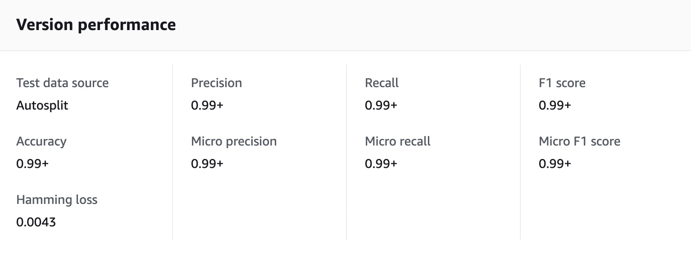

### I used **Amazon Comprehend** (a cloud NLP service) to benchmark my model. 

### **Set Up:**

The AI service was fairly easy to set up as I am familiar with AWS:

1. First, I uploaded my data as a CSV file into an **AWS S3 bucket** (ensuring that it had the correct formatting: two columns total, where the first column is the label and the second is the email subject line + message). 

    a. Code for the reformatting of the CSV files can be found here: [ComprehendDataReformatting.py](https://github.com/anastasiaarsky/ML_Capstone/blob/main/Benchmarking/ComprehendDataReformatting.py) 
    
2. Then, I created a Custom **Classifier Model in Amazon Comprehend**. The model settings were as follows: 
 
    a. Classifier Mode: Single-label mode (as each line in my data comprises of one class and one document)
   
    b. Data format: CSV file
    
    c. Training dataset: path to CSV file in the S3 bucket I made in step 1
    
    d. Test dataset: Autosplit (Comprehend selects 10% of your provided training data to use as testing data)

3. I also created a new **IAM role** so that my Classifier Model could access the S3 bucket that the Training data was in

### **Results:**

*Note: hard cases consist of 250 harder-to-detect non-spam emails*

1. For **Data.csv** (excluding hard cases), my model had an accuracy of 0.99+ and an F1 score of 0.99+. 

    Full performance details:

    

2. For **Full_data.csv** (including hard cases), my model had an accuracy of 0.99+ and an F1 score of 0.99+. 

    Full performance details:

    
